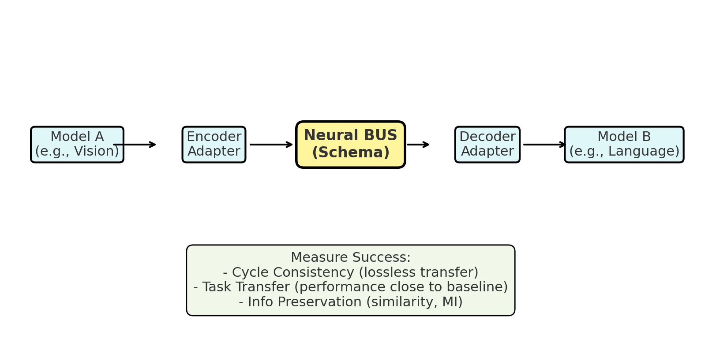

# Neural BUS — Distilled Model-to-Model Communication

> **A standardized protocol for cross-model communication that enables richer information transfer between AI systems.**

A plug-and-play Neural BUS (schema + adapters + router) that allows one AI model (e.g., Vision) to transfer usable internal state to another (e.g., Language). The transfer is distilled to be compact and task-preserving — similar to how brain regions exchange signals beyond simple text.



## Problem Statement

Current multimodal systems communicate through **lossy text only** (captions, transcripts), which discards valuable intermediate structure and semantic information. This creates a bottleneck where rich visual understanding gets compressed into simple descriptions before reaching language models.

The Neural BUS addresses this by introducing a **standardized packet protocol** that preserves semantic structure through vector embeddings while maintaining interpretability through text views.

## Solution Overview

- **Schema**: Standardized BUS packet with vector + text views and provenance metadata
- **Adapters**: Encoders/decoders that map model-specific states to/from BUS format
- **Knowledge Distillation**: Train BUS pathway to match performance of stronger teacher pipelines
- **Evaluation**: Task transfer accuracy, cycle consistency, and information preservation metrics

## Architecture

```
Image → ResNet-50 → EncoderAdapter → BUS Packet → DecoderAdapter → LLM → Answer
                                      ↓
                              {vector: [512D], 
                               text: "caption",
                               provenance: metadata}
```

**Teacher Pipeline (Baseline)**
```
Image + Question → BLIP-2 → LLM → Answer Logits
```

**Student Pipeline (Neural BUS)**
```
Image → ResNet-50 → BUS → LLM → Answer Logits
                    ↓
            Knowledge Distillation Loss
```

## Repository Structure

```
Neural-BUS/
├── README.md
├── setup_env.py
├── requirements.txt
├── example.config.yaml
├── assets/                    # Demo images and diagrams
├── data/
│   └── vqa.py        # VQA v2 subset loader
├── models/
│   ├── vision_encoder.py     # ResNet-50 backbone
│   ├── captioner.py          # BLIP-2 captioner
│   ├── llm_decoder.py        # LLM wrapper (Mistral/LLaMA)
│   └── adapters/
│       ├── encoder.py        # Vision → BUS
│       ├── decoder.py        # BUS → LLM
│       └── inverse_adapter.py # Cycle consistency
├── bus/
│   └── schema.py             # BUS packet definition
├── eval/
│   ├── task_transfer.py      # VQA accuracy evaluation
│   └── cycle_consistency.py  # Feature reconstruction metrics
├── scripts/
│   ├── pipeline.py           # Core pipeline implementation
│   ├── run_pipeline.py       # End-to-end demo
│   ├── train_adapters.py     # Knowledge distillation training
│   └── evaluate.py           # Comprehensive evaluation
├── training/
│   ├── losses.py             # KD + cycle losses
│   └── trainer.py            # Training orchestration
├── utils/
│   └── logging.py            # Metrics logging utilities
└── results/
    └── metrics.json          # Evaluation results
```

## Quick Start

### Environment Setup
```bash
git clone https://github.com/vishomallaoli/neural-bus-protocol.git
cd neural-bus-protocol
python3 setup_env.py
source venv/bin/activate
```
The `setup_env.py` will install all your requirements.

### Demo (No Training Required)
```bash
python scripts/run_pipeline.py \
  --image path/to/example.jpg \
  --question "What color is the cup?" \
  --vision resnet50 \
  --llm mistral-7b
```

**Data Flow:**
Image → ResNet-50 → EncoderAdapter → BUS packet (vector + caption) → DecoderAdapter → LLM → Answer

### Training with Knowledge Distillation
```bash
python scripts/train_adapters.py \
  --dataset vqa \
  --epochs 3 \
  --batch-size 16 \
  --teacher blip2 \
  --student neural_bus
```

**Training Objective:**
- **L_KD**: Knowledge distillation loss (KL divergence between teacher and student logits)
- **L_cycle**: Cycle consistency loss (cosine similarity between original and reconstructed features)
- **L_total = λ_KD × L_KD + λ_cycle × L_cycle**

### Evaluation
```bash
python scripts/evaluate.py --dataset vqa --split val
```

**Metrics:**
- **Task Transfer**: VQA accuracy comparison (BUS vs Teacher vs Caption-only)
- **Cycle Consistency**: Cosine similarity between original and reconstructed vision features
- **Information Preservation**: Measures how well BUS retains semantic content

## BUS Packet Format

```json
{
  "header": {
    "source": "vision.v1",
    "intent": "vqa"
  },
  "payload": {
    "vector": {
      "dim": 512,
      "data": "..."
    },
    "text": "A red cup sits on a wooden table."
  },
  "provenance": {
    "model_commit": "resnet50@abc123"
  }
}
```

## Datasets and Models

- **Dataset**: VQA v2 subset (5k samples for MVP)
- **Vision Encoder**: ResNet-50 (torchvision)
- **Teacher Model**: BLIP-2 for baseline comparison
- **Language Model**: Mistral-7B/LLaMA (HuggingFace)

## Success Criteria

### MVP Requirements
- ✅ End-to-end pipeline operational (Vision → BUS → LLM)
- ✅ BUS-mediated QA achieves ≥70% of teacher pipeline accuracy
- ✅ Cycle consistency shows cosine similarity ≥0.6

### Research Validation
- Demonstrate non-trivial information preservation through cycle metrics
- Show ablation effects (vector-only vs text-only vs combined)
- Package results in research-style evaluation

## Expected Results

| Method | VQA Acc. ↑ | Δ vs Teacher ↓ | Cosine (cycle) ↑ | Packet Size (KB) ↓ |
|--------|------------|----------------|------------------|---------------------|
| Teacher (BLIP-2) | ~80% | - | - | - |
| Caption-only | ~65% | -15% | - | 0.5 |
| BUS (vector+text) | **~75%** | **-5%** | **0.65** | **2.1** |

## Course Timeline (CSCI 487 - Fall 2025)

### Phase 1: Foundation (Sep 5 - Sep 29)
- **Sep 5**: Project Prospectus submitted
- **Sep 7**: Begin MVP development
- **Sep 26**: Project Requirements document
- **Sep 29**: **Status Report 2** - Initial Demo
  - *Deliverable*: Working pipeline demo with BUS packet generation

### Phase 2: Core Implementation (Oct 1 - Oct 27)
- **Oct 1-15**: Implement BLIP-2 teacher pipeline
- **Oct 15-25**: Knowledge distillation training loop
- **Oct 27**: **Status Report 4** - Second Demo
  - *Deliverable*: Teacher vs Student accuracy comparison

### Phase 3: Analysis & Documentation (Nov 1 - Nov 30)
- **Nov 1-7**: Evaluation metrics and ablation studies
- **Nov 7**: **Design Specification** submitted
- **Nov 7-30**: Comprehensive evaluation and documentation
- **Nov 30**: **User Manual** submitted

### Phase 4: Final Delivery (Dec 1 - Dec 7)
- **Dec 1-5**: **Final Oral Presentations**
- **Dec 7**: **Final Report & Product Delivery**
- **Dec 8-12**: Exit interviews and project evaluation

## Roadmap

### Completed
- [x] Project conceptualization and literature review
- [x] Repository structure and basic pipeline implementation
- [x] BUS packet schema definition

### Current Phase
- [ ] Teacher pipeline integration (BLIP-2)
- [ ] Knowledge distillation implementation
- [ ] Initial evaluation on VQA subset

### Future Extensions
- [ ] Symbolic triples integration
- [ ] Multi-modal routing capabilities  
- [ ] Bidirectional communication (Vision reconstruction)
- [ ] Workshop paper submission

## Academic Context

This project serves as a **senior capstone project** for CSCI 487 at the University of Mississippi, with research applications extending toward graduate study preparation. The work explores fundamental questions in multimodal AI communication protocols and knowledge distillation.

**Research Positioning**: While existing vision-language models (BLIP-2, GPT-4V) provide end-to-end solutions, Neural BUS addresses the orthogonal problem of **standardized inter-model communication protocols** - enabling modular, efficient, and measurable information exchange between independently trained models.

## Contributing

This is a solo academic project with structured development phases aligned to course deliverables. Issues and enhancements are tracked according to course milestones.

## License

MIT License - Academic Senior Year Project, University of Mississippi, Fall 2025

## Citation

```bibtex
@software{neural_bus_2025,
  title  = {Neural BUS: Distilled Model-to-Model Communication},
  author = {Visho Malla Oli},
  year   = {2025},
  school = {University of Mississippi},
  course = {CSCI 487 - Senior Project},
  url    = {https://github.com/vishomallaoli/neural-bus-schema}
}
```

---

**Contact**: For questions regarding this academic project, please refer to course documentation or project supervision channels.
